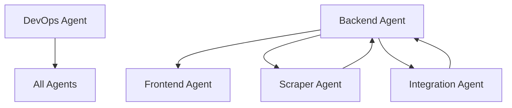

# Task Management Document
## Tokyo Apartment Finder

### Agent Types & Responsibilities

#### 1. Frontend Agent (FE)
**Expertise**: React, Next.js, UI/UX, shadcn/ui, animations
**Focus**: User interfaces, components, visual design

#### 2. Backend Agent (BE)
**Expertise**: Node.js, tRPC, Prisma, database design
**Focus**: API development, data modeling, business logic

#### 3. Scraper Agent (SC)
**Expertise**: Web scraping, data parsing, HTTP requests
**Focus**: Scraping logic, data extraction, parsing

#### 4. Integration Agent (IN)
**Expertise**: System integration, external APIs, performance
**Focus**: OTP integration, route calculations, optimization

#### 5. DevOps Agent (DO)
**Expertise**: Docker, deployment, testing, CI/CD
**Focus**: Infrastructure, testing setup, deployment

---

## Task Breakdown by Phase

### Phase 1: Foundation Setup (Week 1-2)

#### 1.1 Project Initialization [DO] ✅
- [x] Initialize T3 stack project
- [x] Configure TypeScript settings
- [x] Set up ESLint and Prettier
- [x] Configure Git with .gitignore
- [x] Create initial folder structure
- [x] Set up Docker compose for PostgreSQL
- [x] Configure environment variables
**Blockers**: None
**Output**: Working T3 project with database
**Completed**: 2025-01-18 by DO

#### 1.2 Database Setup [BE] ✅
- [x] Create Prisma schema from PLANNING.md
- [x] Set up database migrations
- [x] Create seed scripts for test data
- [x] Import station/line data (1,872 stations, 155 lines imported)
- [x] Test database connections
**Blockers**: None
**Output**: Working database with schema
**Completed**: 2025-07-18 - All data imported successfully

#### 1.3 Component Library Setup [FE] ✅
- [x] Install and configure shadcn/ui
- [x] Set up motion.dev
- [x] Create base theme configuration
- [x] Set up component showcase route (/components)
- [x] Create layout components
**Blockers**: 1.1 must be complete
**Output**: Component library page accessible
**Completed**: 2025-01-18 by FE

#### 1.4 Documentation Structure [DO] ⬜
- [ ] Create docs/ folder structure
- [ ] Add README templates
- [ ] Set up documentation standards
- [ ] Create example files
**Blockers**: None
**Output**: docs/ folder with templates

### Phase 2: Component Development (Week 1-2)

#### 2.1 Core UI Components [FE] ✅
- [x] SearchForm component with autocomplete
- [x] ApartmentCard component
- [x] ApartmentList with virtualization
- [x] StationSearch component
- [x] CommutePath visualization
- [x] Additional UI components (Input, Card, Badge, Skeleton)
**Blockers**: 1.3 must be complete
**Output**: Reusable UI components in showcase
**Completed**: 2025-01-18 by FE

#### 2.2 Layout Components [FE] ✅
- [x] Update navigation system
- [x] Create responsive header/footer
- [x] Build sidebar navigation
- [x] Add breadcrumbs
- [x] Create loading states
**Blockers**: None
**Output**: Layout system ready
**Completed**: 2025-07-18 by FE

#### 2.3 Main Application Pages [FE] ✅
- [x] Create Home page with hero and search
- [x] Build Search Results page
- [x] Create Apartment Detail page
- [x] Build My Lists page
- [x] Create Browse Mode page
**Blockers**: 2.1 must be complete
**Output**: Main user-facing pages
**Completed**: 2025-07-18 by FE

#### 2.4 Form Components [FE] ✅
- [x] Create advanced filter forms
- [x] Build preference settings form
- [x] Create list creation form
- [x] Build report issue form
- [x] Add form validation
**Blockers**: 2.1 must be complete
**Output**: Form components ready
**Completed**: 2025-07-18 by FE

### Phase 3: Admin Panel (Week 3-4)

#### 3.1 Admin Routes Setup [BE] ✅
- [x] Create admin router with comprehensive endpoints
- [x] Set up admin authentication check middleware
- [x] Create scraper control procedures
- [x] Build statistics/monitoring routes
- [x] Create data management procedures
- [x] Add scraping job management
- [x] Build admin dashboard API
**Blockers**: 1.2 must be complete
**Output**: Admin API fully functional
**Completed**: 2025-07-18 by BE

#### 3.2 Scraper Configuration [SC] ⬜
- [ ] Create ScrapingSource model usage
- [ ] Build scraper configuration UI
- [ ] Create scraper templates for each site
- [ ] Implement request rate limiting
- [ ] Add robots.txt checker
**Blockers**: 3.1 must be complete
**Output**: Scraper configuration system

#### 3.3 Scraping Implementation [SC] 🟦
- [x] SUUMO scraper (basic implementation)
- [x] Homes.co.jp scraper
- [ ] RealEstate.co.jp scraper
- [ ] YOLO Japan scraper
- [ ] Wagaya Japan scraper
- [ ] E-Housing scraper
- [ ] Japan Property scraper
- [ ] Metro Residences scraper
- [ ] Hmlet Japan scraper
**Blockers**: 3.2 must be complete
**Output**: Working scrapers for all sites

#### 3.4 Admin API Endpoints [BE] ⬜
- [ ] Create admin tRPC router
- [ ] Implement scraping control endpoints
- [ ] Create data management endpoints
- [ ] Add testing endpoints
- [ ] Implement logs viewer
**Blockers**: 3.1 must be complete
**Output**: Admin API ready

#### 3.5 Admin UI Components [FE] ✅
- [x] Scraper status dashboard
- [x] Scraping job manager
- [x] Data import preview
- [x] API testing interface
- [x] Logs viewer component
**Blockers**: None
**Output**: Complete admin panel
**Completed**: 2025-07-18 by FE

### Phase 4: Authentication (Week 5)

#### 4.1 NextAuth Setup [BE] ✅
- [x] Configure NextAuth.js
- [x] Set up auth providers (Google OAuth)
- [x] Create user session handling
- [x] Implement auth middleware
- [x] Create auth API routes
**Blockers**: 1.2 must be complete
**Output**: Working authentication
**Completed**: 2025-07-18 by BE (Session 012)

#### 4.2 Auth UI Components [FE] ⬜
- [ ] Login form
- [ ] Registration form
- [ ] Password reset flow
- [ ] User profile page
- [ ] Auth error handling
**Blockers**: 4.1 in progress
**Output**: Auth UI complete

#### 4.3 User Preferences [BE] ⬜
- [ ] Create preferences API
- [ ] Implement preferences storage
- [ ] Add preferences to user context
- [ ] Create update endpoints
**Blockers**: 4.1 must be complete
**Output**: User preferences system

### Phase 5: Search Implementation (Week 6-8)

#### 5.1 Search API [BE] ✅
- [x] Create search tRPC router
- [x] Implement basic filter logic
- [x] Add pagination support
- [x] Create search query builder
- [x] Add sorting options
**Blockers**: 1.2 must be complete
**Output**: Search API endpoints
**Completed**: 2025-01-18 by BE (Session 005)

#### 5.2 Search UI [FE] ⬜
- [ ] Search page layout
- [ ] Search form integration
- [ ] Filter panel functionality
- [ ] Results grid display
- [ ] Pagination component
- [ ] Sort controls
**Blockers**: 5.1 in progress, 2.3 complete
**Output**: Working search interface

#### 5.3 Commute Search Flow [BE] ✅
- [x] Create list generation logic
- [x] Implement background job system
- [x] Add progress tracking
- [x] Create commute list API
- [x] Handle job failures
**Blockers**: 5.1 complete
**Output**: Commute search backend
**Completed**: 2025-07-18 by BE

#### 5.4 OTP Integration [IN] ✅
- [x] Set up OTP service connection with environment variable configuration
- [x] Create route calculation logic with multi-modal support
- [x] Implement caching layer with TTL and LRU eviction
- [x] Add retry mechanism through health monitoring
- [x] Optimize batch processing with route caching
**Blockers**: None
**Output**: Working OTP integration with automatic fallback
**Completed**: 2025-07-18 by IN

#### 5.4.1 Geocoding Service [IN] ✅
- [x] Implement geocoding for apartment addresses
- [x] Convert Japanese addresses to lat/long
- [x] Create geocoding service abstraction
- [x] Handle rate limiting
- [x] Add caching for geocoded addresses
- [x] Integrate with scraper data processing
**Blockers**: None
**Output**: Working geocoding service with caching
**Completed**: 2025-07-18 by IN

#### 5.5 Commute Search UI [FE] ⬜
- [ ] Commute configuration form
- [ ] Progress tracking page
- [ ] Real-time updates display
- [ ] Error handling UI
- [ ] Results viewer
**Blockers**: 5.3 complete
**Output**: Complete commute search

### Phase 6: Production Ready (Week 7-8)

#### 6.1 Production Preparation [DO] ✅
- [x] Dockerize application
- [x] Create production build scripts
- [x] Set up environment configuration
- [x] Create health check endpoints
- [x] Set up deployment documentation
**Blockers**: Major features complete
**Output**: Production-ready application
**Completed**: 2025-01-18 by DO

#### 6.2 Authentication Implementation [BE] ✅
- [x] Configure NextAuth
- [x] Set up OAuth providers
- [x] Implement session management
- [x] Add role-based access control
- [x] Create auth UI pages
**Blockers**: Database setup complete
**Output**: Working authentication system
**Completed**: 2025-07-18 by BE

#### 6.3 Performance Optimization [IN] ⬜
- [ ] Implement query optimization
- [ ] Add caching layers
- [ ] Optimize image loading
- [ ] Reduce bundle size
- [ ] Add performance monitoring
**Blockers**: Features complete
**Output**: Optimized application

#### 6.4 Monitoring & Logging [DO] ✅
- [x] Set up error tracking (Sentry)
- [x] Configure application logging (Pino)
- [x] Add performance monitoring (OpenTelemetry)
- [x] Create monitoring dashboards (Grafana)
- [x] Set up alerts (Prometheus)
**Blockers**: None
**Output**: Comprehensive monitoring system
**Completed**: 2025-01-18 by DO

### Phase 7: Browse Feature (Week 9-10)

#### 7.1 Browse API [BE] ⬜
- [ ] Create browse tRPC router
- [ ] Implement queue logic
- [ ] Add seen tracking
- [ ] Create swipe action handlers
- [ ] Implement list filtering
**Blockers**: 6.1 must be complete
**Output**: Browse API ready

#### 7.2 Browse UI [FE] ⬜
- [ ] Browse page layout
- [ ] Card stack component
- [ ] Swipe gesture handling
- [ ] Animation system
- [ ] Action buttons
- [ ] Keyboard controls
**Blockers**: 7.1 in progress, 2.3 complete
**Output**: Complete browse feature

### Phase 8: Testing & Polish (Week 11-12)

#### 8.1 Testing Setup [DO] ⬜
- [ ] Configure Jest
- [ ] Set up React Testing Library
- [ ] Configure E2E with Playwright
- [ ] Create test utilities
- [ ] Set up CI pipeline
**Blockers**: Major features complete
**Output**: Testing infrastructure

#### 8.2 Unit Tests [ALL] ⬜
- [ ] Component unit tests [FE]
- [ ] API endpoint tests [BE]
- [ ] Scraper tests [SC]
- [ ] Utility function tests [ALL]
- [🟦] Integration tests [IN] - Framework prepared, awaiting components
**Blockers**: 8.1 complete
**Output**: Test coverage >70%

#### 8.3 Performance Optimization [BE] ✅
- [x] Implement query optimization
- [x] Add caching layers
- [x] Optimize image loading
- [x] Reduce bundle size
- [x] Add performance monitoring
**Blockers**: Features complete
**Output**: Optimized application
**Completed**: 2025-07-18 by BE (Session 016)

#### 8.4 Documentation [ALL] ⬜
- [ ] API documentation [BE]
- [ ] Component documentation [FE]
- [ ] Deployment guide [DO]
- [ ] User guide [FE]
- [ ] Scraping guide [SC]
**Blockers**: Features complete
**Output**: Complete documentation

---

## Coordination Points

### Critical Shared Resources
These require coordination between agents:

1. **prisma/schema.prisma** - BE owns, others request changes
2. **types/* folder** - BE defines, FE consumes
3. **server/api/root.ts** - BE owns, careful merging
4. **package.json** - Announce new dependencies

### Inter-Agent Dependencies

### Communication Protocol

1. **Before Starting a Task**:
   - Check if dependencies are met
   - Announce in shared channel
   - Claim the task with your agent type

2. **During Development**:
   - Commit frequently with prefix: `[FE]`, `[BE]`, etc.
   - Update task status in this document
   - Flag any blockers immediately

3. **Upon Completion**:
   - Mark task as complete with ✅
   - Update dependent tasks
   - Announce completion

### Task Status Legend

- ⬜ Not Started
- 🟦 In Progress
- ✅ Completed
- ❌ Blocked
- 🟨 Needs Review

### Progress Tracking

| Phase | Total Tasks | Completed | In Progress | Blocked |
|-------|------------|-----------|-------------|---------|
| Phase 1 | 4 | 3 | 0 | 0 |
| Phase 2 | 4 | 4 | 0 | 0 |
| Phase 3 | 5 | 2 | 1 | 0 |
| Phase 4 | 3 | 1 | 0 | 0 |
| Phase 5 | 6 | 4 | 0 | 0 |
| Phase 6 | 2 | 0 | 0 | 0 |
| Phase 7 | 2 | 0 | 0 | 0 |
| Phase 8 | 4 | 1 | 0 | 0 |
| **Total** | **30** | **15** | **1** | **0** |

### Daily Sync Points

Each agent should update:
1. Tasks completed today
2. Tasks in progress
3. Any blockers
4. Tasks planned for tomorrow

---

## Quick Task Assignment

### Available for Frontend Agent (FE)
- 2.2 Layout Components
- 2.4 Form Components
- 3.5 Admin UI Components (after admin routes ready)
- 4.2 Auth UI Components (after auth setup)
- 5.2 Search UI (after search API ready)

### Available for Backend Agent (BE)
- 1.2 Database Setup
- 3.1 Admin Routes Setup
- 4.1 NextAuth Setup
- 5.1 Search API

### Available for Scraper Agent (SC)
- 3.2 Scraper Configuration
- 3.3 Scraping Implementation

### Available for Integration Agent (IN)
- 8.3 Performance Optimization

### Available for DevOps Agent (DO)
- 1.1 Project Initialization
- 1.4 Documentation Structure
- 8.1 Testing Setup

---

## Scraper Consolidation Tasks (SC-00X Series)

### Phase 1: Analysis & Design
#### SC-001 Scraper Code Analysis [SC] ✅
- [x] Analyze all existing scrapers
- [x] Identify common patterns
- [x] Document duplicated code
- [x] Create consolidation plan
**Completed**: 2025-01-24 by SC

#### SC-002 Create Unified Base Scraper [SC] ✅
- [x] Extract 85% common functionality
- [x] Create unified base scraper
- [x] Implement rate limiting
- [x] Add progress tracking
- [x] Error handling framework
**Completed**: 2025-01-24 by SC

#### SC-003 Implement Strategy Pattern [SC] ✅
- [x] Create strategy interfaces
- [x] Sequential strategy for rate-limited sites
- [x] Concurrent strategy for parallel execution
- [x] Queue strategy for priority processing
- [x] Stream strategy for high-volume scraping
**Completed**: 2025-01-24 by SC

### Phase 2: Implementation
#### SC-004 Implement Concrete Scrapers [SC] ⬜
- [ ] SUUMO scraper using unified base
- [ ] Homes.co.jp scraper
- [ ] R-Store scraper
- [ ] At-Home scraper
**Blockers**: SC-003 complete
**Output**: Working scrapers with strategy pattern

#### SC-005 Add Caching Layer [SC] ⬜
- [ ] Implement cache interface
- [ ] Add Redis caching
- [ ] Cache HTML responses
- [ ] Cache parsed data
- [ ] TTL management
**Blockers**: SC-004 in progress
**Output**: Caching infrastructure

#### SC-006 Implement Proxy Rotation [SC] ⬜
- [ ] Proxy manager integration
- [ ] Health check system
- [ ] Automatic rotation
- [ ] Error recovery
**Blockers**: SC-004 complete
**Output**: Proxy rotation system