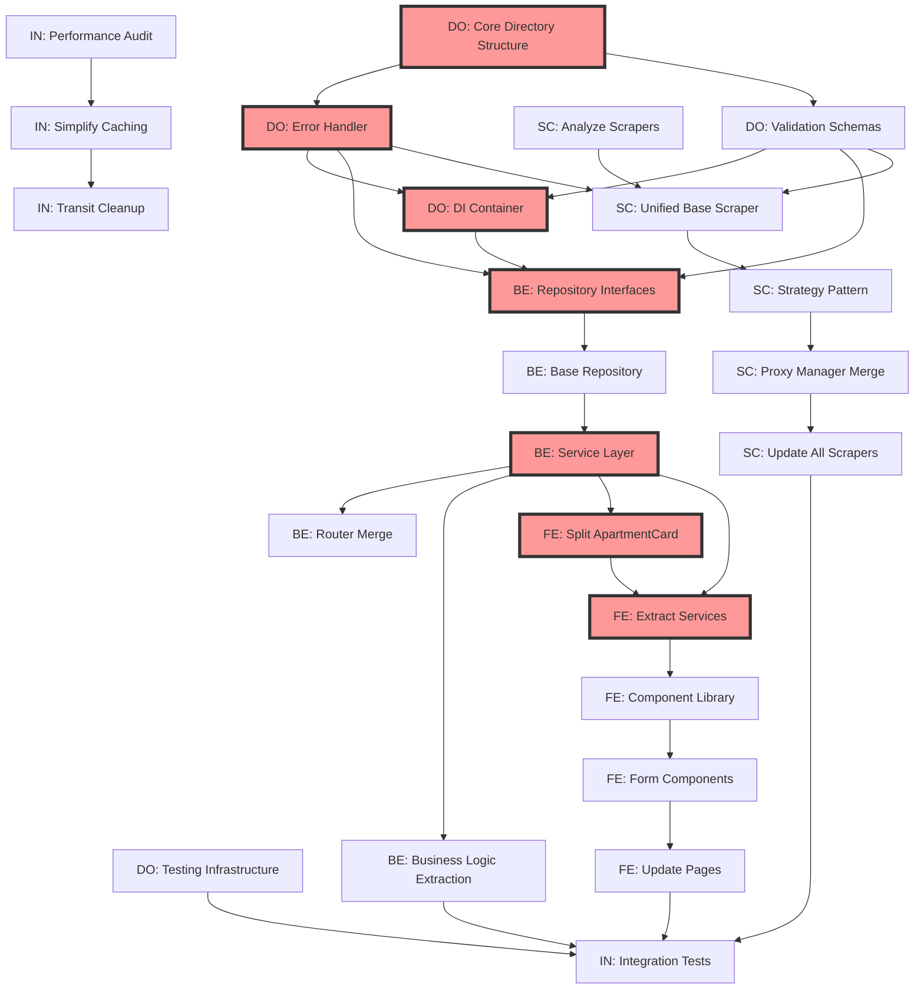

# Task Dependency Matrix

**Last Updated**: 2025-01-24
**Critical Path Length**: 15 days

## 🔄 Dependency Graph



## 📊 Task Dependencies Table

| Task ID | Task Name | Owner | Depends On | Enables | Duration |
|---------|-----------|-------|------------|---------|----------|
| **DO-001** | Core Directory Structure | DO | - | DO-002, DO-003 | 0.5 days |
| **DO-002** | Error Handler | DO | DO-001 | BE-001, SC-002 | 1 day |
| **DO-003** | Validation Schemas | DO | DO-001 | BE-001, SC-002 | 1 day |
| **DO-004** | DI Container | DO | DO-002, DO-003 | BE-001 | 2 days |
| **DO-005** | Testing Infrastructure | DO | - | IN-004 | 1 day |
| **BE-001** | Repository Interfaces | BE | DO-002, DO-003, DO-004 | BE-002 | 1 day |
| **BE-002** | Base Repository | BE | BE-001 | BE-003 | 1 day |
| **BE-003** | Service Layer | BE | BE-002 | BE-004, BE-005, FE-001 | 2 days |
| **BE-004** | Router Merge | BE | BE-003 | - | 1 day |
| **BE-005** | Business Logic Extraction | BE | BE-003 | IN-004 | 2 days |
| **SC-001** | Analyze Scrapers | SC | - | SC-002 | 1 day |
| **SC-002** | Unified Base Scraper | SC | SC-001, DO-002, DO-003 | SC-003 | 2 days |
| **SC-003** | Strategy Pattern | SC | SC-002 | SC-004 | 1 day |
| **SC-004** | Proxy Manager Merge | SC | SC-003 | SC-005 | 1 day |
| **SC-005** | Update All Scrapers | SC | SC-004 | IN-004 | 2 days |
| **FE-001** | Split ApartmentCard | FE | BE-003 | FE-002 | 1 day |
| **FE-002** | Extract Services | FE | FE-001, BE-003 | FE-003 | 1 day |
| **FE-003** | Component Library | FE | FE-002 | FE-004 | 1 day |
| **FE-004** | Form Components | FE | FE-003 | FE-005 | 1 day |
| **FE-005** | Update Pages | FE | FE-004 | IN-004 | 2 days |
| **IN-001** | Performance Audit | IN | - | IN-002 | 1 day |
| **IN-002** | Simplify Caching | IN | IN-001 | IN-003 | 2 days |
| **IN-003** | Transit Cleanup | IN | IN-002 | - | 1 day |
| **IN-004** | Integration Tests | IN | DO-005, BE-005, SC-005, FE-005 | - | 3 days |

## 🚨 Critical Path

The critical path (longest dependent chain) is:
```
DO-001 → DO-002/DO-003 → DO-004 → BE-001 → BE-002 → BE-003 → FE-001 → FE-002 → FE-003 → FE-004 → FE-005 → IN-004
```
**Total Duration**: 15 days

## 🔥 Parallel Work Opportunities

### Week 1 - Maximum Parallelization
```
Parallel Track 1: DO-001 → DO-002/DO-003 → DO-004
Parallel Track 2: SC-001 (can start immediately)
Parallel Track 3: IN-001 → IN-002 (can start immediately)
Parallel Track 4: DO-005 (can start immediately)
```

### Week 2 - Convergence Points
```
After DO completes:
- BE can start all tasks
- SC can complete implementation
- FE waits for BE-003
```

### Week 3 - Final Integration
```
All tracks converge at IN-004
```

## ⚠️ Risk Mitigation

### High-Risk Dependencies
1. **DO-004 (DI Container)** - Blocks all BE work
   - *Mitigation*: Start with simple implementation, iterate
   
2. **BE-003 (Service Layer)** - Blocks all FE work
   - *Mitigation*: Define interfaces early, mock implementation

3. **IN-004 (Integration Tests)** - Depends on everything
   - *Mitigation*: Write test structure early, fill in as components complete

### Dependency Breaking Strategies
1. **Interface-First Development**: Define contracts before implementation
2. **Mocking**: Use mock implementations to unblock dependent work
3. **Feature Flags**: Allow parallel development of old/new code
4. **Partial Delivery**: Deliver working subsets to unblock others

## 📅 Suggested Schedule

### Day 1-2
- DO: Start DO-001, DO-002, DO-003, DO-005
- SC: Start SC-001
- IN: Start IN-001
- BE: Review contracts, prepare
- FE: Review contracts, prepare

### Day 3-4
- DO: Complete DO-004
- SC: Start SC-002
- IN: Start IN-002
- BE: Start BE-001
- FE: Design component architecture

### Day 5-7
- DO: Support other teams
- SC: Complete SC-003, SC-004
- IN: Complete IN-002, IN-003
- BE: Complete BE-002, start BE-003
- FE: Prepare for component work

### Day 8-10
- BE: Complete BE-003, BE-004, BE-005
- SC: Complete SC-005
- FE: Start FE-001, FE-002
- IN: Prepare integration tests

### Day 11-13
- FE: Complete FE-003, FE-004, FE-005
- All: Bug fixes, integration support

### Day 14-15
- IN: Lead IN-004 with all teams
- All: Final integration and testing

## 🔄 Update Protocol

When updating dependencies:
1. Check impact on critical path
2. Update mermaid diagram
3. Recalculate durations
4. Notify affected agents
5. Update progress tracker

---
*Dependencies define the flow of work. Respect them to avoid blockers!*