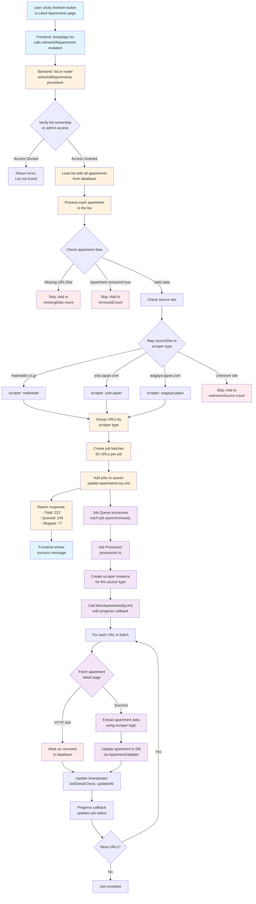

# Refresh Listings Process Flow

## Visual Flow Diagram



## Detailed Process Breakdown

### 1. Frontend Initiation (Blue)
- User is on `/lists` page viewing their "Liked Apartments" list
- Clicks the refresh button which triggers `refreshAllApartments` mutation
- Shows loading state while processing

### 2. Backend Processing (Orange)
1. **Access Control**
   - Verifies user owns the list or is admin
   - Returns error if unauthorized

2. **Data Loading**
   - Loads complete list with all apartment references
   - Total example: 222 apartments

3. **Filtering & Grouping**
   - **Skip removed apartments**: `apartment.removed === true`
   - **Skip missing data**: No `sourceUrl` or `sourceSite`
   - **Skip unknown sources**: Can't map to scraper
   - **Group by scraper type**: Organize remaining URLs

4. **Job Creation**
   - Batches URLs (50 per job)
   - Creates background jobs for each batch
   - Returns summary to frontend

### 3. Asynchronous Job Processing (Purple)
1. **Job Execution**
   - Each job runs independently
   - Creates appropriate scraper instance
   - Processes URLs one by one

2. **Apartment Fetching**
   - Fetches detail page for each URL
   - Checks for removal (404 = removed)
   - Extracts updated data if available

3. **Database Updates**
   - Updates apartment details
   - Marks removed apartments
   - Updates timestamps (lastDetailCheck, updatedAt)
   - Tracks progress for UI updates

## Example Numbers (Your Case)

```
Initial State:
- Total apartments in list: 222
- Active apartments: 145
- Skipped apartments: 77

Breakdown of 77 skipped:
- Removed (already marked): ~40-50
- Missing sourceUrl/sourceSite: ~20-30
- Unknown source sites: ~5-10

Processing:
- 145 apartments → ~3 jobs (50 per job)
- Each job processes in parallel
- Updates complete in 1-3 minutes typically
```

## Key Points

1. **Only active listings are refreshed** - Removed apartments stay removed
2. **Batch processing** - Prevents overwhelming scrapers
3. **Asynchronous execution** - UI remains responsive
4. **Progress tracking** - Real-time updates via job queue
5. **Error handling** - Failed fetches don't stop the process

## Code References

- **Frontend trigger**: `src/app/lists/page.tsx`
- **Backend mutation**: `src/server/api/routers/list.ts:refreshAllApartments`
- **Job processor**: `src/lib/jobs/processors.ts:update-apartments-by-urls`
- **Scraper logic**: `src/lib/scrapers/apartment-scraper.ts:fetchApartmentsByUrls`
- **Update logic**: `src/lib/scrapers/utils/apartment-updater.ts`